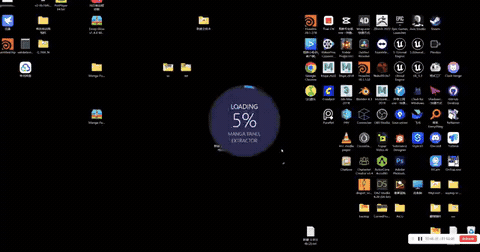

# Image Cutter

一个用于自动识别与裁切漫画分镜的桌面工具。本项目在原有分镜提取能力的基础上进行了二次开发，补充了图片拖放、批量处理、裁切结果预览、手动裁切、缩放和平移等使用体验改进。

## 使用方式

1. 安装项目依赖：`pip install -r requirements.txt`
2. 启动图形界面：`python src/main.py --gui`
3. 将图片拖入图片列表，或选择输入目录与输出目录。
4. 点击“开始自动裁切”，完成后可通过“裁切图片查看”预览结果。

## 使用演示

[](docs/assets/usage-demo.mp4)

*点击上方动图可打开完整使用演示视频。*

## 核心功能

- 支持拖放添加多张图片，也可从输入目录批量读取图片。
- 使用 AI 自动识别漫画分镜并分别导出；同名图片会自动避免输出文件名冲突。
- 可选择不合并、横向合并或纵向合并相邻分镜。
- 支持将每张原图的裁切结果输出到独立文件夹。
- 提供裁切结果图库：可刷新、自动刷新、选择并删除结果，右键可在资源管理器中定位文件。
- 提供手动裁切：滚轮缩放、中键平移、绘制多个裁切框；裁切框以原图坐标保存，缩放后位置不会漂移。

## 模型与处理流程

- **检测模型**：项目使用基于 [YOLOv5](https://github.com/ultralytics/yolov5) 的自定义分镜检测权重。
- **权重文件**：`src/ai-models/2024-11-00/best.pt`，启动时由 PyTorch 通过 `torch.hub` 加载。
- **推理流程**：图片先转换为灰度图，经高斯模糊和拉普拉斯边缘处理，再由模型输出分镜边界框；程序按边界框从原图裁出对应画面。
- **合并模式**：可按横向或纵向对检测到的相邻分镜进行组合，适合连续条状画面。
- **首次启动**：源码模式首次加载模型时，PyTorch 可能需要访问网络以获取 YOLOv5 的运行时代码并建立本地缓存；之后通常可直接使用缓存。

## 技术栈

| 用途 | 组件 |
| --- | --- |
| 桌面界面 | PyQt6 |
| 模型推理 | PyTorch、YOLOv5 自定义权重 |
| 图像读写与裁切 | OpenCV、NumPy |
| 批量任务 | PyQt `QThread` 后台线程 |
| 打包 | PyInstaller、Inno Setup |

## 项目结构

```text
src/
├── ai-models/2024-11-00/best.pt  # 分镜检测模型权重
├── gui/                          # 主界面、结果图库与图片查看器
├── image_processing/             # 模型加载、检测与裁切逻辑
├── myutils/                      # 路径与图片读取工具
└── main.py                       # 程序入口
docs/assets/                      # README 使用演示视频与动图预览
```

## 致谢

本项目基于 [adenzu/Manga-Panel-Extractor](https://github.com/adenzu/Manga-Panel-Extractor) 进行二次开发。感谢原作者 **adenzu** 提供的漫画分镜提取项目、算法实现与开源基础。

原项目采用 [MIT License](https://github.com/adenzu/Manga-Panel-Extractor/blob/main/LICENSE) 发布；使用、分发或继续修改源自原项目的代码时，请遵守该许可证的条款。

## 说明

- 分镜检测主要面向漫画页面设计；对于条漫、网漫或特殊排版，识别效果可能因图像内容而异。
- 自动裁切结果建议先在“裁切图片查看”中核对；对少量漏检或边界不理想的画面，可用手动裁切补充。
- 本仓库提供的是二次开发版本；如继续分发或修改源自原项目的代码，请保留原项目的许可证与致谢信息。
